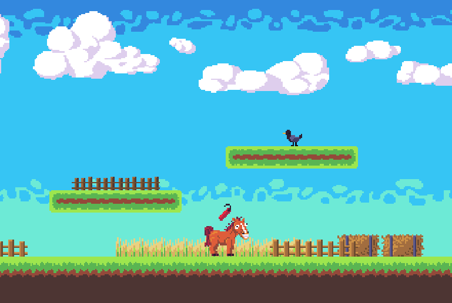

# Rickety Ranch
_A simple platformer about an unhinged horse and his quest to destroy everything._  

Made for Ludum Dare 49 3-day game jam (Theme: `Unstable`)  
https://ldjam.com/events/ludum-dare/49/rickety-ranch  

Ranked **5th place for humor** (out of ~3000).  



## How to Play
Download and extract for your platform, or play online at https://www.greenxenith.com/ricketyranch.  
Controls: `WASD` or arrow keys.  

## Jam Results
```
Overall:    470th  (3.722 average from 38 ratings)
Fun:        286th  (3.833 average from 38 ratings)
Innovation: 1275th (2.764 average from 38 ratings)
Theme:      545th  (3.75  average from 38 ratings)
Graphics:   146th  (4.375 average from 38 ratings)
Humor:      5th    (4.625 average from 38 ratings)
Mood:       221st  (3.944 average from 38 ratings)
```
([source](https://ldjam.com/events/ludum-dare/49/rickety-ranch))
